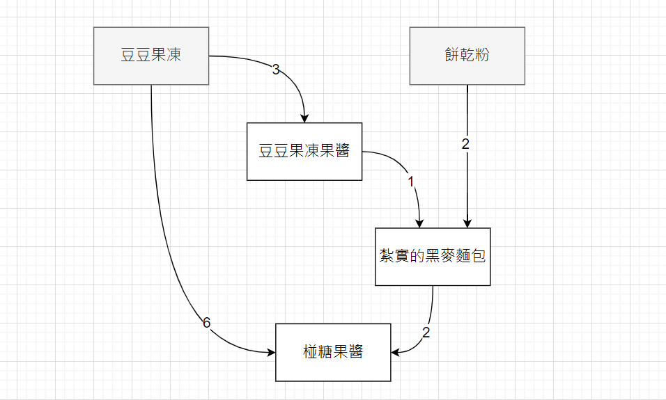

# Cookie Kingdom Value Calculator

Automatically generates value grid for all kinds of ingredients and compounds. Can specify what value to generate and how to print those values.

It also act as a somehow better way to record statistics about compounds. Since all compounds / ingredients are in python class format, you can output to any format you like with a few lines of code.

## How to Use

Write the compound and ingredients in `ingredient_class.py` and run `cal_cost.py`. 

## How to Change Value Table Output

In `cal_cost.py`, value is generated via topological sort. All nodes in graph contains a kind of ingredient / compound, and links is established in terms of `(ingredient -> compound)`.

For example, here is the graph of 椪糖果醬 (old recipe):

Given a function `func`, `Node.topologicalWalk(nodes, func)` will apply `func` to current node, in the order of a valid topological sort. Use this function to store values in a node, and output your desired value table using those values.